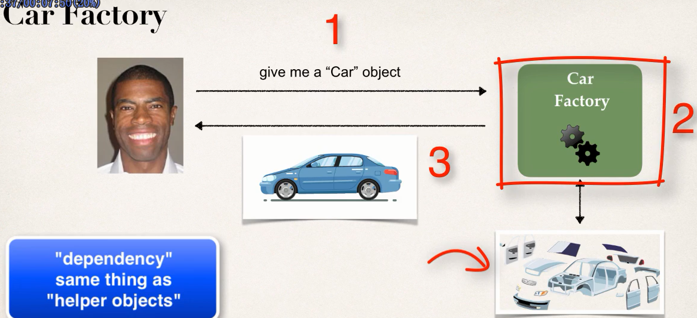
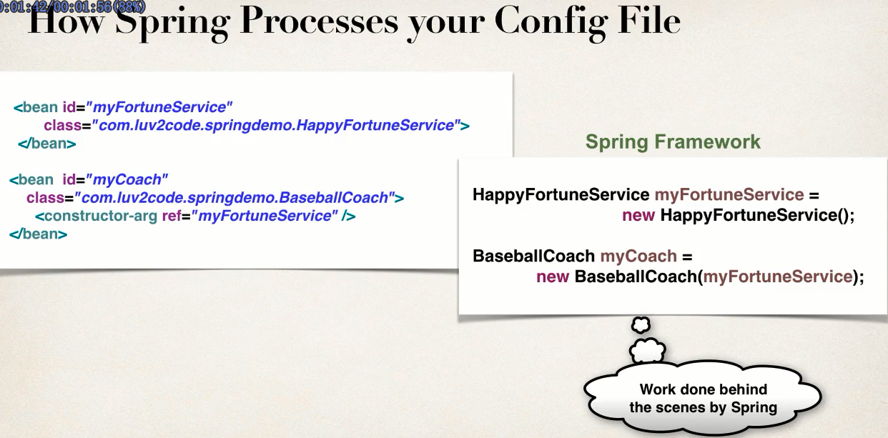
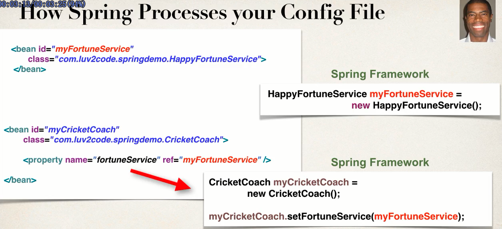
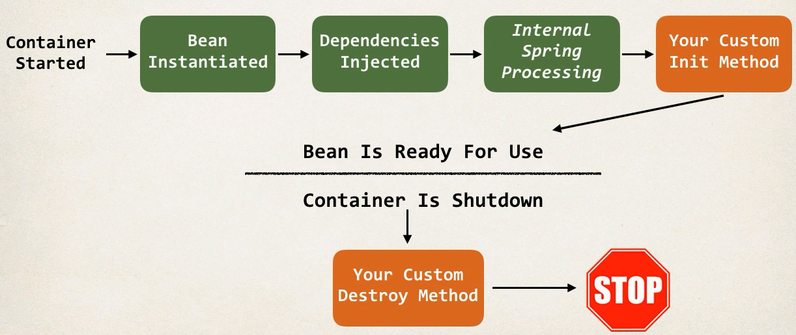

## core spring
learn spring  framework


> App should be configurable


Spring has an object factory.Spring is responsiable for creating objects and also responsiable for injecting dependency(help)

## Ioc(Inverson of Control)


## Inject Object's dependencies(dependcy Injection)


+ constructor injection
+ setter injection





### How Spring Process config files





## Bean scope


[ApplicationContext.xml](01-Spring-demo/src/ApplicationContext.xml)


> scope

- [singleton  默认]()
- [prototype]()

### Bean lifecycle methods

> init-method  destroy-method




## Annotation config

- @Component Ioc
- @Autowired dependency injection


### 背景

- Configure your spring beans with Annotaions that can minimize the xml configuration size.

### spring framework 背后的工作

- Spring will scan your java class for special annotaions
- Automatically reister the beans in container.

### 步骤

- Enable component scanning in spring config file
    ```xml
    <context:component-scan base-package="edu.cau.hzz" />
    ```
- Add @component annotation to your java classes.


### 细节

- Default id: the class name: make first letter lower-case


---

### Dependency Injection Annotaion


- construtor injection
    ```java
    @Autowired
    public TrackCoach(@Qualifier("randomFortuneService") FortuneService fortuneService) {
        this.fortuneService = fortuneService;
    }
    ```
- setter injection
- Field Injection
    ```java
    @Autowired
    @Qualifier("randomFortuneService")
    private FortuneService fortuneService;
    ```
- Any method 
> Inject dependencies by calling any method on your class


> Spring will find a bean that implements the interface.
If exists multiple beans.You need to use @Qualifier to state the bean id. 


---

### Bean scope annotation

> @Scope("prototype")
> @Postconstructor @PreDestroy  javax.annotation


---


## Inject properties

> Reference values from properties file
```java
@Component
@Scope("singleton")
@PropertySource("classpath:sport.properties")
public class TrackCoach implements Coach {

    // inject properties
    @Value("${foo.email}")
    private String email;
    //...
}
```

- @PropertySource
- @Value("${}")


## Spring Jar

- [spring jar download](http://repo.spring.io/release/org/springframework/spring/)
- [spring xml configure](https://docs.spring.io/spring/docs/4.2.x/spring-framework-reference/html/xsd-configuration.html)


[Click Me->Next topic-SpringMVC Framework]()