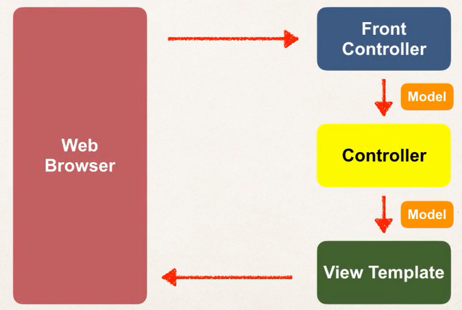

## SpringMVC

> Model View Control
 



> Behind the scenes

- Front Controller: DispathcherServlet

---
- Controller: business logic
- Model: store/retrieve data
- View Template: jsp thym


## Set up environment

- 用eclipse(JavaEE)，而不是vscode。因为要创建dynamic web project
- tomcat
- connect to tomcat

[spring-mvc-demo](./03-Spring-MVC-demo/spring-mvc-demo)

### springmvc configuration process

- [web.xml](03-Spring-MVC-demo/WebContent/WEB-INF/web.xml)
- [spring-mvc-demo-servlet.xml](03-Spring-MVC-demo/WebContent/WEB-INF/spring-mvc-demo-servlet.xml)

1. 配置web.xml 经典的servlet配置,我们使用springmvc的DispatcherServlet 参照官网 [spring docs web.xml配置DispatcherServlet](https://docs.spring.io/spring/docs/current/spring-framework-reference/web.html#mvc-servlet-context-hierarchy)
```xml 
  <servlet>
  	<servlet-name>dispatcher</servlet-name>
  	<servlet-class>org.springframework.web.servlet.DispatcherServlet</servlet-class>
  	<init-param>
  		<param-name>contextConfigLocation</param-name>
        <param-value>/WEB-INF/spring-mvc-demo-servlet.xml</param-value>
  	</init-param>
  	<load-on-startup>1</load-on-startup>
  </servlet>
  
  <servlet-mapping>
  	<servlet-name>dispatcher</servlet-name>
  	<url-pattern>/</url-pattern>
  </servlet-mapping>
```

2. 配置DispatcherServlet,也就是Spring配置 参照 [spring mvc配置](https://docs.spring.io/spring/docs/current/spring-framework-reference/web.html#mvc-config)和[spring xml configure](https://docs.spring.io/spring/docs/4.2.x/spring-framework-reference/html/xsd-configuration.html)
```xml
<?xml version="1.0" encoding="UTF-8"?>
<beans xmlns="http://www.springframework.org/schema/beans"
    xmlns:mvc="http://www.springframework.org/schema/mvc"
    xmlns:xsi="http://www.w3.org/2001/XMLSchema-instance"
    xmlns:context="http://www.springframework.org/schema/context"
    xsi:schemaLocation="
        http://www.springframework.org/schema/beans
        https://www.springframework.org/schema/beans/spring-beans.xsd
        http://www.springframework.org/schema/mvc
        https://www.springframework.org/schema/mvc/spring-mvc.xsd
        http://www.springframework.org/schema/context 
        http://www.springframework.org/schema/context/spring-context.xsd">

    <!-- enable MVC configuration -->
    <mvc:annotation-driven/>

</beans>
```

3. Spring的配置，在spring-mvc-demo-servlet.xml文件中，允许Ioc annotation
```xml
    <!--Step 3: Add support for component scanning  -->
    <context:component-scan base-package="edu.cau.hzz" />
    <!-- Step 4: enable MVC configuration and support for conversion,formatting and validation-->
    <mvc:annotation-driven/>

    <!-- Step 5: Define Spring MVC View resolver -->
    <bean id="viewResolver" class="org.springframework.web.servlet.view.InternalResourceViewResolver">
        <property name="prefix" value="/WEB-INF/view/"/>
        <property name="suffix" value=".jsp"/>
    </bean>
```


**生成web.xml问题**
 Dynamic Web Project –> RightClick –> Java EE Tools –> Generate Deployment Descriptor Stub.


**运行第一个SpringMVC,jsp出现红叉问题** [The superclass “javax.servlet.http.HttpServlet” was not found on the Java Build Path in Eclipse](https://howtodoinjava.com/eclipse/solved-the-superclass-javax-servlet-http-httpservlet-was-not-found-on-the-java-build-path-in-eclipse/)


[error eclipse](https://stackoverflow.com/questions/54290263/more-than-one-fragment-with-the-name-spring-web-was-found-this-is-not-legal-w)


## Model

+ Model 是数据的容器，是Controller与View Page中的信使
+ JSP中访问参数是param,Control是HttpServletRequest

Controller参数绑定
```java
//直接获取	
public String processFormVersionThree(
			@RequestParam("studentName") String theName,
			Model model)
// 通过HttpServletRequest
public String letsShoutDude(HttpServletRequest request,Model model) {
		// Read the request parameter from request
		String theName = request.getParameter("studentName");
        //...
}s
```


----------


## @RequestMapping

+ 修饰class
+ 修饰method


## Spring MVC Form tags

[spring-mvc-demo](./spring-mvc-demo)

> 数据绑定流程


表单数据绑定

[Controller]() 注意model.addAttribute,@ModelAttribute
```java
@RequestMapping("/showForm")
public String showForm(Model theModel) {
    // create a student object
    Student theStudent = new Student();
    //add student object to the model
    theModel.addAttribute("student", theStudent);
    return "student-form";
}


@RequestMapping("/processForm")
public String processForm(@ModelAttribute("student") Student student) {
    // log the input data
    System.out.println(student);
    return "student-confirmation";
}
```

[View]() 使用spring mvc form tags，注意modelAttribute
```jsp
<form:form action="processForm" method="GET" modelAttribute="student">
    First name: <form:input path="firstName" />
    <br><br>
    Last name: <form:input path="lastName" />
    <br><br>
    <input type="submit" value="Submit"> 
</form:form>

<!-- 取出数据 -->
The Student is confirmed: ${student.firstName} ${student.lastName}

```


### 下拉列表

```jsp
<form:select path="country">
    <form:option value="China" label="China"/>
    <form:option value="Japan" label="Japan"/>
    <form:option value="India" label="India"/>
    <form:option value="America" label="America"/>
</form:select>
```

```jsp
<form:options items="${student.countryOptions}"/>	
```
列表与LinkedHashMap
```java
countryOptions = new LinkedHashMap<>();
countryOptions.put("CN", "China");
```


### 单选框

```jsp
Java<form:radiobutton path="favoriteLanguage" value="Java"/>
```


### 多选框

```jsp
Mac OS<form:checkbox path="operatingSystems" value="Mac OS"/>
Linux<form:checkbox path="operatingSystems" value="Linux"/>
MS Windows<form:checkbox path="operatingSystems" value="MS Windows"/>
```

Java代码处理,字符数组处理
```java
private String[] operatingSystems;
```


显示的时候使用jstl的<c:forEach>功能标签
```jsp
 <%@ taglib prefix="c" uri="http://java.sun.com/jsp/jstl/core"%>
<ul>
    <c:forEach items="${student.operatingSystems}" var="tmp">
        <li>${tmp}</li>
    </c:forEach>
</ul>
```

---


## 校验

> 使用[Hibernate validator](http://hibernate.org/validator/)

### 基本校验

1. 在java bean 对象上添加校验的规则
```java
public class Customer {
	private String firstName;
	
	// adding validation rules
	@NotNull
	@Size(min=1,message="is required")
        private String lastName;
    //
}
```

2. view html编写,如果校验失败就会弹出此信息
```html
<form:errors path="lastName" cssClass="error"/>
```

3. Controller类处理提交的请求，在请求中@Valid 进行校验，检验整个对象，结果在BindingResult
```java
@RequestMapping("/processForm")
public String processForm(
        @Valid @ModelAttribute("customer") Customer customer,
        BindingResult bindingResult) {
    
    if(bindingResult.hasErrors()) {
        return "customer-form";
    }else {
        return "customer-confirmation";
    }
}
```


### 检验时处理空白例子

+ @InitBinder 在所有的请求之前都会调用，StringTrimmerEditor是Spring 的API.去除两端空格。

```java
//在每个请求处理之前都会先调用该方法
@InitBinder
public void initBinder(WebDataBinder dataBinder) {
    System.out.println("called initBinder method.");
    StringTrimmerEditor stringTrimmerEditor = new StringTrimmerEditor(true);
    //对String都采用stringTrimmerEditor
    dataBinder.registerCustomEditor(String.class, stringTrimmerEditor);
}
```

### 数字范围

```java
@Min(value=0,message="must be greater than or equal to zero")
@Max(value=10,message="must be less than or equal to 10")
private int freePasses;
```

### 正则表达

```java
@Pattern(regexp = "^[a-zA-Z0-9]{5}",message = "only 5 char/digits")
private String postalCode;
```


### 配置文件处理String - Interge 转换问题

> 处理长串的自带字符信息

[resources/messages.properties](spring-mvc-demo/src/resources/messages.properties)
```
error type, model attri, field , message
typeMismatch.customer.freePasses=Invalid number
```

在配置文件
[spring-mvc-demo-servlet.xml](spring-mvc-demo/WebContent/WEB-INF/spring-mvc-demo-servlet.xml)  ResourceBundleMessageSource
```xml
<!--  load custom message resources -->
<bean id="messageSource"
    class="org.springframework.context.support.ResourceBundleMessageSource">
    <property name="basenames" value="resources/messages" />
</bean>
```

error type 信息通过后台测试代码bindingResult知道
```java
@RequestMapping("/processForm")
public String processForm(
        @Valid @ModelAttribute("customer") Customer customer,
        BindingResult bindingResult) {
    
    System.out.println("Last name: | "+customer.getLastName()+" |");
    System.out.println("Binding Result: "+bindingResult);
    //...
        }
```

## 自定义validator

[code](spring-mvc-demo/src/edu/cau/validation)

1. 创建注解
```java
@Constraint(validatedBy = CourseCodeConstraintValidator.class)
@Target({ElementType.METHOD,ElementType.FIELD})
@Retention(RetentionPolicy.RUNTIME)
public @interface CourseCode {
	//define default course code
	public String value() default "LUV";
	//define default error message
	public String message() default "must start with LUV"; 
	//define default groups
	public Class<?>[] groups() default {};
	//define default payloads
	public Class<? extends Payload>[] payload() default {};
}
```


2. 定义校验规则
```java
public class CourseCodeConstraintValidator 
	implements  ConstraintValidator<CourseCode, String>{
	
	private String coursePrefix;
	
	@Override
	public void initialize(CourseCode courseCode) {
		// TODO Auto-generated method stub
		this.coursePrefix = courseCode.value();
	}

	@Override
	public boolean isValid(String code, ConstraintValidatorContext constraint) {
		// TODO Auto-generated method stub
		boolean result;
		if(code == null) {
			result = true;
		}else {
			result = code.startsWith(coursePrefix);
		}
		return result;
	}
}
```


## SpringMVC Docs

[spring mvc doc](http://www.luv2code.com/spring-mvc-docs)

[spring mvc doc](https://docs.spring.io/spring/docs/current/spring-framework-reference/web.html#mvc)


[Oracle Develop Servlet官网->web.xml Descriptor Element](https://docs.oracle.com/cd/E24329_01/web.1211/e21049/web_xml.htm#WBAPP502)

[spring docs web.xml配置DispatcherServlet](https://docs.spring.io/spring/docs/current/spring-framework-reference/web.html#mvc-servlet-context-hierarchy)


[spring mvc配置](https://docs.spring.io/spring/docs/current/spring-framework-reference/web.html#mvc-config)


[spring mvc jsp InternalResourceViewResolver](https://docs.spring.io/spring/docs/current/spring-framework-reference/web.html#mvc-view-jsp)


[Hibernate validator](http://hibernate.org/validator/)