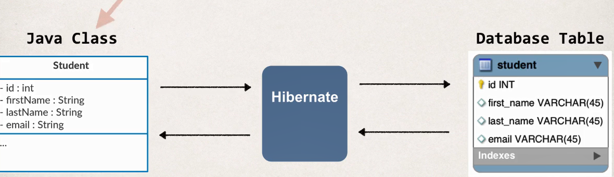
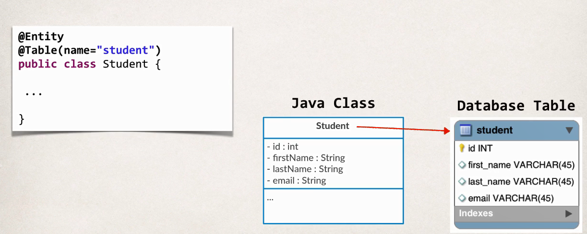
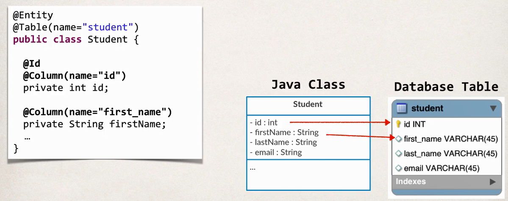

## Hibernate

> persisting / saving Java objects in a database
> easy to store and retrieve objects from the databases




---


## 配置Hibernate

[hibernate.cfg.xml](04-hibernate-tutorial/src/hibernate.cfg.xml)
```xml
<!DOCTYPE hibernate-configuration PUBLIC
        "-//Hibernate/Hibernate Configuration DTD 3.0//EN"
        "http://www.hibernate.org/dtd/hibernate-configuration-3.0.dtd">
<hibernate-configuration>

    <session-factory>

        <!-- JDBC Database connection settings -->
        <property name="connection.driver_class">com.mysql.cj.jdbc.Driver</property>
        <property name="connection.url">jdbc:mysql://localhost:3306/hb_student_tracker?useSSL=false&amp;serverTimezone=UTC</property>
        <property name="connection.username">hbstudent</property>
        <property name="connection.password">hbstudent</property>

        <!-- JDBC connection pool settings ... using built-in test pool -->
        <property name="connection.pool_size">1</property>

        <!-- Select our SQL dialect -->
        <property name="dialect">org.hibernate.dialect.MySQLDialect</property>

        <!-- Echo the SQL to stdout -->
        <property name="show_sql">true</property>

		<!-- Set the current session context -->
		<property name="current_session_context_class">thread</property>
 
    </session-factory>

</hibernate-configuration>
```

### Entity class

**Java class that is mapped to a database table**

+ Map class to database table

+ Map fields to database columns

**Java Annotation**


## 附录

### 创建表

+ 创建一个mysql用户

```sql
CREATE USER 'hbstudent'@'localhost' IDENTIFIED BY 'hbstudent';

GRANT ALL PRIVILEGES ON  * . * TO 'hbstudent'@'localhost';

ALTER USER 'hbstudent'@'localhost' IDENTIFIED WITH mysql_native_password BY 'hbstudent';
```


+ 创建数据库和表

```sql
CREATE DATABASE  IF NOT EXISTS `hb_student_tracker`;
USE `hb_student_tracker`;

--
-- Table structure for table `student`
--

DROP TABLE IF EXISTS `student`;

CREATE TABLE `student` (
  `id` int(11) NOT NULL AUTO_INCREMENT,
  `first_name` varchar(45) DEFAULT NULL,
  `last_name` varchar(45) DEFAULT NULL,
  `email` varchar(45) DEFAULT NULL,
  PRIMARY KEY (`id`)
) ENGINE=InnoDB AUTO_INCREMENT=1 DEFAULT CHARSET=latin1;

```


### 测试驱动

```java
public class TestJdbc {

	public static void main(String[] args) {
		String jdbcUrl = "jdbc:mysql://localhost:3306/hb_student_tracker?useSSL=false&serverTimezone=UTC";
		String user = "hbstudent";
		String pass = "hbstudent";
		
		try {
                System.out.println("Connecting to database: "+jdbcUrl);
                //这一句
        
                Connection myConn = DriverManager.getConnection(jdbcUrl,user,pass);
			
		}catch(Exception exc) {
			exc.printStackTrace();
		}

	}

}
```