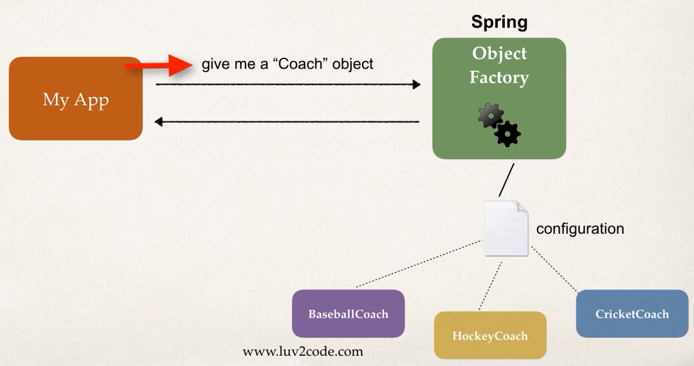
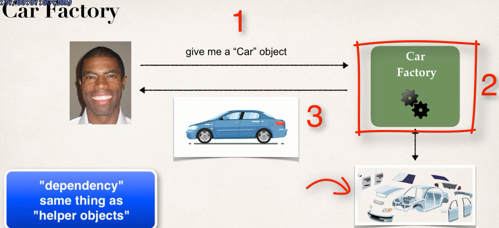
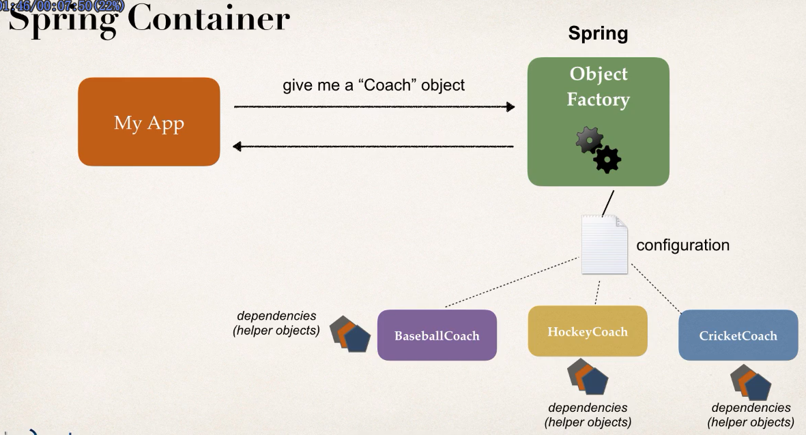
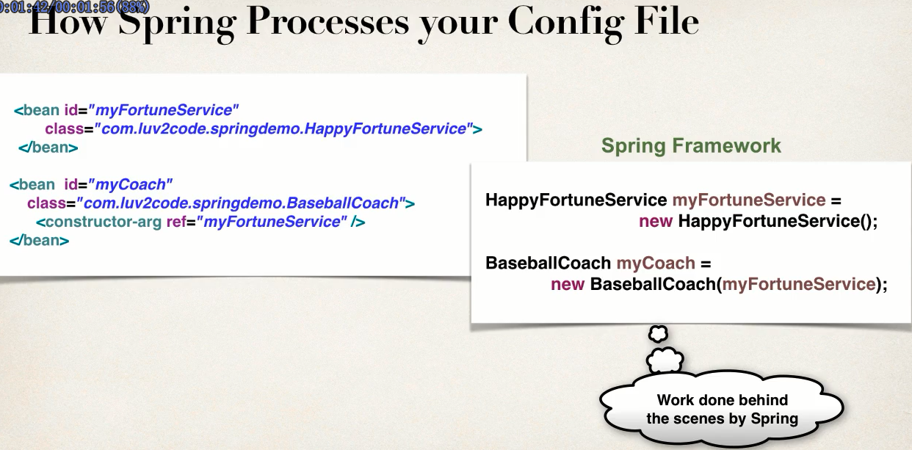
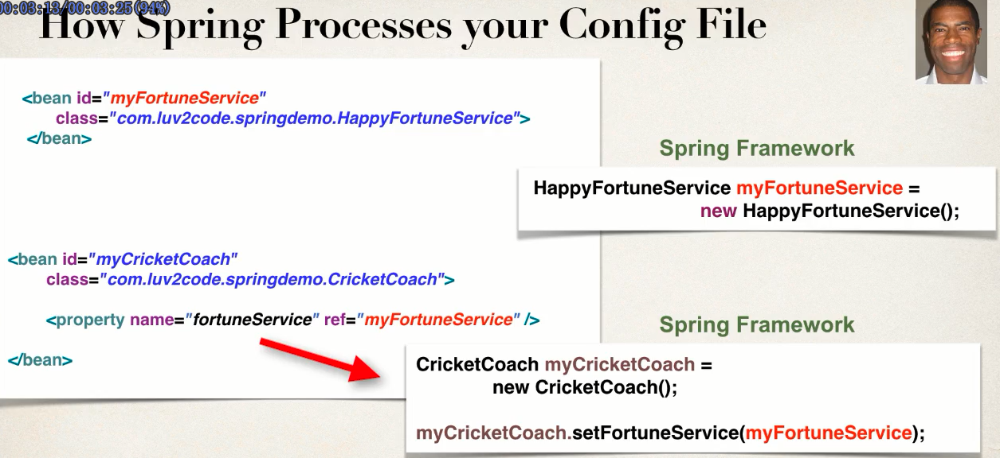
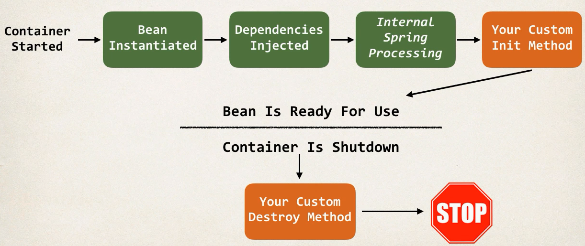

## spring
learn spring  framework

> App should be configurable

Spring has an object factory.Spring is responsiable for creating objects and also responsiable for injecting dependency(help)

## Ioc(Inverson of Control)

## Inject Object's dependencies(dependcy Injection)

+ constructor injection
+ setter injection

### How Spring Process config files

## Bean scope

[ApplicationContext.xml](01-Spring-demo/src/ApplicationContext.xml)

> scope

- [singleton  默认]()
- [prototype]()

### Bean lifecycle methods

> init-method  destroy-method

## Spring Jar

[spring jar download](http://repo.spring.io/release/org/springframework/spring/)